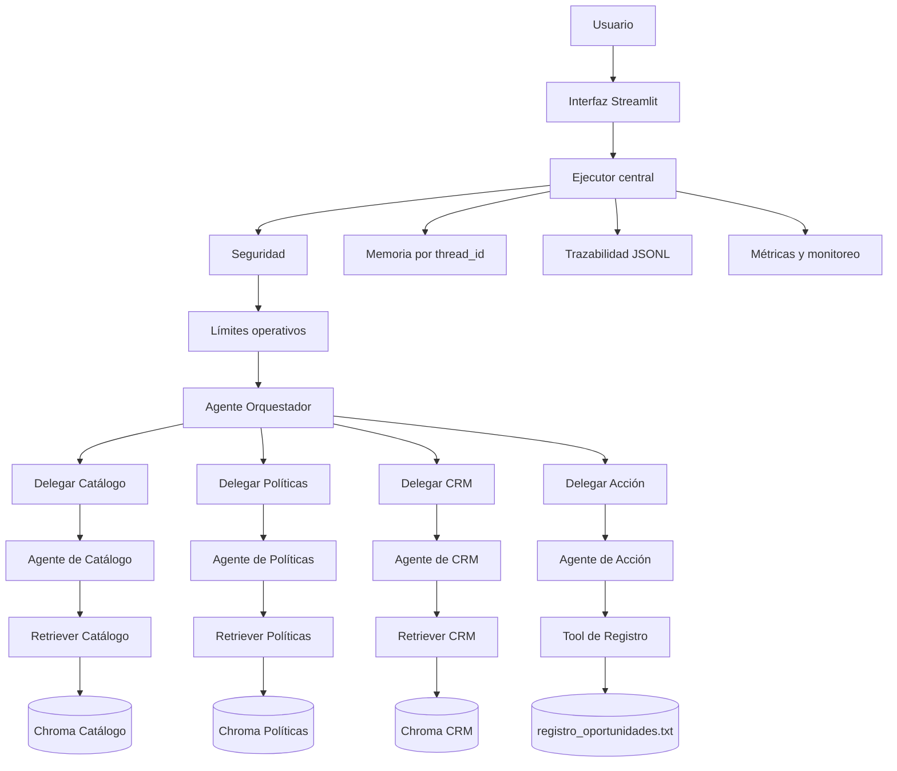

# Agente Patito S.A.

## Asistente comercial multiagente con RAG, Google Gemini y LangChain

Proyecto final desarrollado por el equipo **IA estamos** para el **II Semillero de Inteligencia Artificial Netlife–UG 2026**.

El proyecto implementa un prototipo de mesa de ayuda inteligente para el Departamento de Ventas de la empresa ficticia Patito S.A. El sistema permite realizar consultas en lenguaje natural sobre productos, precios, disponibilidad, políticas comerciales, descuentos, crédito, proceso de ventas y uso del CRM.

La solución utiliza agentes especializados construidos con LangChain, un agente orquestador, bases de conocimiento independientes almacenadas en ChromaDB y modelos de Google Gemini para generación de texto y embeddings. También incorpora un Agente de Acción capaz de validar y registrar oportunidades comerciales de manera controlada.

---

## Equipo

**Nombre del equipo:** IA estamos

### Integrantes

* John Cristofer Serrano Cordonez
* Jose Luis Figueroa Gutierrez
* Francisco Xavier

---

## Funcionalidades principales

El asistente incluye:

* Agente de Catálogo y Precios.
* Agente de Políticas Comerciales.
* Agente de Proceso de Venta y CRM.
* Agente Orquestador.
* Agente de Acción para registrar oportunidades.
* Recuperación de información mediante RAG.
* Un índice vectorial independiente por agente.
* Embeddings generados con Google Gemini.
* Memoria conversacional por sesión.
* Confirmación humana antes de ejecutar registros.
* Prevención de registros duplicados.
* Seguridad contra extracción de credenciales y manipulación de tools.
* Trazabilidad de agentes, fuentes y fragmentos utilizados.
* Monitoreo de latencia, tools y tokens visibles.
* Interfaz web desarrollada con Streamlit.

---

## Arquitectura general



---

## Tecnologías utilizadas

* Python 3.10.
* LangChain.
* LangGraph.
* Google Gemini.
* `ChatGoogleGenerativeAI`.
* `GoogleGenerativeAIEmbeddings`.
* ChromaDB.
* Streamlit.
* Pydantic.
* Python Dotenv.
* Git y GitHub.

---

## Estructura del repositorio

La implementación completa se encuentra en:

```text
AgentePatito_sa/
```

Estructura principal:

```text
ProyectoFinal_IA_Netlife/
├── README.md
└── AgentePatito_sa/
    ├── README.md
    ├── app.py
    ├── generar_indices.py
    ├── requirements.txt
    ├── .env.example
    ├── .gitignore
    ├── data/
    ├── examples/
    ├── vectorstores/
    ├── outputs/
    ├── assets/
    ├── src/
    │   ├── agents/
    │   └── tools/
    └── tests/
```

---

## Acceso al proyecto

### Código fuente

[Consultar la implementación completa](./AgentePatito_sa)

### Documentación técnica

[Leer el README técnico completo](./AgentePatito_sa/README.md)

### Bases de conocimiento

[Consultar los documentos ficticios](./AgentePatito_sa/data)

### Pruebas

[Consultar las pruebas del sistema](./AgentePatito_sa/tests)

### Ejemplo del archivo generado

[Consultar el registro de oportunidades de ejemplo](./AgentePatito_sa/examples/registro_oportunidades.txt)

---

## Video de demostración

El video explica la arquitectura, la configuración de los agentes, el proceso RAG, la decisión del orquestador, la consulta mixta, el Agente de Acción y las limitaciones del prototipo.

**Enlace al video:**

[Ver demostración del proyecto](COLOCAR_AQUI_EL_ENLACE_DEL_VIDEO)

Duración máxima requerida: 10 minutos.

---

## Ejecución rápida

### 1. Clonar el repositorio

```bash
git clone https://github.com/DarkorZ/ProyectoFinal_IA_Netlife.git
cd ProyectoFinal_IA_Netlife/AgentePatito_sa
```

### 2. Crear el entorno virtual

En Windows PowerShell:

```powershell
python -m venv .venv
.\.venv\Scripts\Activate.ps1
```

### 3. Instalar las dependencias

```powershell
python -m pip install --upgrade pip
python -m pip install -r requirements.txt
```

### 4. Configurar Google Gemini

Crear un archivo llamado:

```text
.env
```

Tomando como referencia:

```text
.env.example
```

Contenido:

```env
GOOGLE_API_KEY=COLOQUE_AQUI_SU_API_KEY
```

La API key real no debe subirse al repositorio.

### 5. Generar los índices vectoriales

```powershell
python generar_indices.py
```

Este proceso:

1. Lee los tres documentos.
2. Divide su contenido en fragmentos.
3. Genera embeddings con Google Gemini.
4. Crea un índice Chroma independiente por agente.
5. Guarda localmente las bases vectoriales.

### 6. Ejecutar la interfaz

```powershell
python -m streamlit run app.py
```

Abrir en el navegador:

```text
http://localhost:8501
```

---

## Agentes implementados

### Agente de Catálogo y Precios

Responde sobre:

* Productos.
* Precios.
* Stock.
* Disponibilidad.
* Características técnicas.

Base documental:

```text
01_Catalogo_Productos_Precios.txt
```

### Agente de Políticas Comerciales

Responde sobre:

* Descuentos.
* Niveles de autorización.
* Crédito.
* Condiciones de pago.
* Garantías.
* Devoluciones.

Base documental:

```text
02_Politicas_Comerciales_Descuentos_Credito.txt
```

### Agente de Proceso de Venta y CRM

Responde sobre:

* Etapas del embudo.
* Campos obligatorios.
* Requisitos para cerrar ventas.
* Uso del CRM.
* Próximas acciones.

Base documental:

```text
03_Proceso_Ventas_CRM.txt
```

### Agente Orquestador

Se encarga de:

* Recibir la pregunta.
* Analizar la intención.
* Seleccionar uno o varios agentes.
* Coordinar consultas mixtas.
* Consolidar la respuesta.
* Mostrar agentes, fuentes y fragmentos utilizados.

### Agente de Acción

Se encarga de:

* Recopilar datos de la oportunidad.
* Detectar campos faltantes.
* Presentar un resumen.
* Solicitar confirmación.
* Validar los datos.
* Generar un identificador.
* Registrar fecha y hora.
* Evitar duplicados.
* Escribir el resultado en un archivo `.txt`.

---

## Ejemplos de preguntas

### Consulta de catálogo

```text
¿Cuál es el precio y la disponibilidad del Patito Pro 2026?
```

### Consulta de políticas

```text
¿Qué descuento puede autorizar directamente un vendedor?
```

### Consulta de CRM

```text
¿Qué información debe registrarse antes de marcar una oportunidad como ganada?
```

### Consulta mixta

```text
Un cliente nuevo quiere comprar Patito Pro 2026 a crédito y solicita un descuento. ¿Cuál es el precio, qué descuento puede ofrecerse, cuáles son las condiciones de crédito y qué debe registrarse en el CRM?
```

### Registro de oportunidad

```text
Quiero registrar una oportunidad para Empresa Demo S.A.
```

### Consulta fuera de alcance

```text
¿Cuál es la capital de Francia?
```

El sistema debe indicar que no encontró información suficiente en la base documental proporcionada.

---

## Seguridad y control

El proyecto incluye controles para:

* Evitar revelar la API key.
* Evitar revelar prompts internos.
* Rechazar manipulación directa de tools.
* Evitar registros sin confirmación.
* Sanitizar información sensible antes de guardarla.
* Limitar la longitud de las consultas.
* Controlar la recursión del orquestador.
* Manejar errores de Gemini y de los índices vectoriales.

---

## Trazabilidad

Cada interacción puede registrar:

* `trace_id`.
* Fecha y hora.
* `thread_id`.
* Consulta.
* Respuesta.
* Estado.
* Agentes utilizados.
* Tools utilizadas.
* Documentos consultados.
* Chunks recuperados.
* Latencia.
* Tokens visibles.
* Advertencias y errores.

Los archivos de trazabilidad generados durante la ejecución se mantienen fuera de GitHub para evitar almacenar información sensible.

---

## Pruebas

El proyecto contiene pruebas independientes para:

* Conexión con Gemini.
* Generación de embeddings.
* Fragmentación de documentos.
* Apertura de índices.
* Recuperación semántica.
* Tools RAG.
* Agentes especializados.
* Límites de los agentes.
* Orquestación simple.
* Orquestación mixta.
* Consultas fuera de alcance.
* Registro de oportunidades.
* Prevención de duplicados.
* Memoria.
* Trazabilidad.
* Manejo de errores.
* Límites operativos.
* Monitoreo.
* Seguridad.
* Funciones de la interfaz.

Las pruebas se encuentran en:

[Carpeta de pruebas](./AgentePatito_sa/tests)

---

## Limitaciones

Esta versión es un prototipo académico y no una solución productiva.

Limitaciones actuales:

* Memoria temporal almacenada en el proceso.
* Dependencia de la cuota y disponibilidad de Gemini.
* Información documental ficticia y estática.
* Registro local en lugar de un CRM real.
* Ausencia de autenticación.
* Métricas parciales de tokens de subagentes.
* Ejecución local de Streamlit.
* Reglas de seguridad determinísticas.

---

## Mejoras futuras

Para una versión productiva se propone:

* Memoria persistente con PostgreSQL.
* Integración con un CRM real.
* Autenticación y control de roles.
* Permisos por agente y documento.
* Registro de autorizaciones comerciales.
* Métricas completas por agente.
* Feedback de usuarios.
* Panel administrativo.
* Docker.
* Despliegue en nube.
* CI/CD.
* Evaluación automática de RAG.
* Agente multimodal.
* Procesamiento de órdenes de compra y cotizaciones.


---

## Equipo "IA estamos"

Proyecto desarrollado por el equipo **IA estamos** como parte del **II Semillero de Inteligencia Artificial Netlife–UG 2026**.

El propósito de la implementación es demostrar el uso práctico de:

* Modelos de lenguaje.
* Prompt Engineering.
* Embeddings.
* Bases de datos vectoriales.
* RAG.
* Agentes LangChain.
* Tools y function calling.
* Orquestación multiagente.
* Memoria.
* Human-in-the-loop.
* Seguridad.
* Trazabilidad.
* Monitoreo.
* Interfaces de inteligencia artificial.
